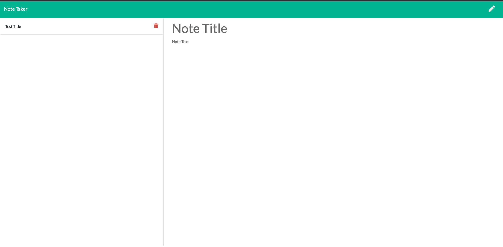

# Note-Grabber

## Description

Welcome ! Note Grabber is a note taking application that allows you to create, save, delete, and edit notes at any 
given take. 

You can visit the [website](https://note-grabber.herokuapp.com/) yourself by tapping on the link, give it a try.

## Table of Contents
- [Note-Grabber](#note-grabber)
- [Description](#description)
- [Table-of-Contents](#table-of-contents)
- [User-Story](#user-story)
- [Mock-up](#mock-up)
- [Technologies](#technologies)
- [Installation](#installation)
- [Usage](#usage)
- [Contributing](#contributing)
- [Test](#test)
- [Licenes](#license)
- [Badge](#badge)

## User Story

~~~
AS A small business owner
I WANT to be able to write and save notes
SO THAT I can organize my thoughts and keep track of tasks I need to complete
~~~

## Mock Up

## Technologies 

| ID # | Technologies |
| --- | --- |
| 1 | HTML5 |
| 2 | CSS |
| 3 | JavaScript |
| 4 | Makrdown |
| 5 | Node.js |
| 6 | Express.js |

## Installation 

Refactored the starter code and cloned it onto my VSCode, added serval files and at the end i deployed it on Heroku. 

## Usage 

purpose is to take notes 

## Contributing 

[Farhan](https://github.com/fheezy) tap on the link to see more of my work! 

## Test 

you can check the deployed website by click on this [link](https://note-grabber.herokuapp.com/)

## License 
MIT License

Copyright (c) 2022 Farhan Hoque

Permission is hereby granted, free of charge, to any person obtaining a copy
of this software and associated documentation files (the "Software"), to deal
in the Software without restriction, including without limitation the rights
to use, copy, modify, merge, publish, distribute, sublicense, and/or sell
copies of the Software, and to permit persons to whom the Software is
furnished to do so, subject to the following conditions:

The above copyright notice and this permission notice shall be included in all
copies or substantial portions of the Software.

THE SOFTWARE IS PROVIDED "AS IS", WITHOUT WARRANTY OF ANY KIND, EXPRESS OR
IMPLIED, INCLUDING BUT NOT LIMITED TO THE WARRANTIES OF MERCHANTABILITY,
FITNESS FOR A PARTICULAR PURPOSE AND NONINFRINGEMENT. IN NO EVENT SHALL THE
AUTHORS OR COPYRIGHT HOLDERS BE LIABLE FOR ANY CLAIM, DAMAGES OR OTHER
LIABILITY, WHETHER IN AN ACTION OF CONTRACT, TORT OR OTHERWISE, ARISING FROM,
OUT OF OR IN CONNECTION WITH THE SOFTWARE OR THE USE OR OTHER DEALINGS IN THE
SOFTWARE.

## Badge

